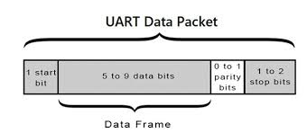

# UART Receiver in VHDL

A configurable and fault-tolerant UART receiver implementation for FPGAs



## 📌 Overview
This project implements a **fullt parameterizable UART receiver** in VHDL, capable of decoding serial data with **error detection** (framing errors) and **baud-rate flexibility**. Designed for FPGA platforms (tested on Xilinx Zynq-7000).

This project was done using Vivado 2024.1

## 📂 Repository Structure

```
my-project/
├── README.md
├── package.json
├── images/
│   └── logo.png
├── src/
│   ├── index.js
│   └── utils/
│       └── helper.js
└── test/
    └── test_main.js
```


## ⚙️ Features
### 1. Core Functionality
- **8N1 Format**: 8 data bits, no parity, 1 stop bit
- **Baud-Rate Flexibility**: Supports any baud rate via generics
- **Error Handling**: Detects framing errors

### 2. Reliability Enhancements
- Double-registered input synchronization
- Mid-bit sampling (50% of baud period)
- False start bit detection

## 🚀 Getting Started
### Simulation 
```bash
vcom -2008 rtl/uart_rx.vhd rtl/baud_generator.vhd sim/uart_rx_tb.vhd
vsim work.uart_rx_tb
add wave *
run -all
```

