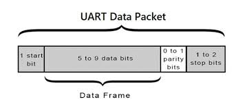
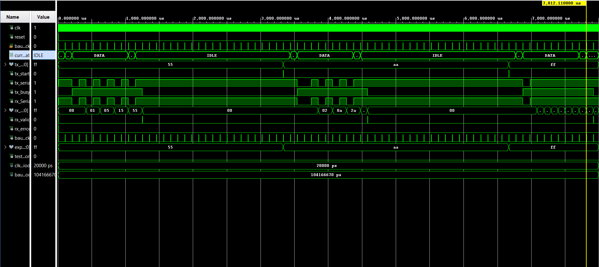

# UART Transmitter and Receiver Project (VHDL, Vivado)

## 🔧 Project Title
**UART-Based Serial Communication system with Testbenches**

A configurable and fault-tolerant UART receiver implementation for FPGAs



## 📜 Description
This project implements a **Universal asynchronous Receiver Transmitter (UART)** system using VHDL, targeting the **Zynq-7000 FPGA platform**. It includes three core modules:

- `baud_generator` : Generates clock enable pulses (baud ticks) at the specified baud rate.
- `uart_tx` : Transmits 8-bit serial data with start and stop bits.
- `uart_rx` : Receives and reconstructs 8-bit data from a serial input stream.

In addition, there are **unit-level testbenches** (`uart_tx_tb`,`uart_rx_tb`) and a full **integration testbench** (`uart_tx_rx_tb`) to validate end-to-end data communication.

This project was done using Vivado 2024.1

---

## 📂 Repository Structure

```
project-1/
├── README.md
├── .gitignore
├── assets
├── project-1.hw
├── project-1.ip_user_files
├── project_1.sim/sim_1/behav/xsim
├── project_1.srcs
├── project_1.xpr
```

---

## 📡 UART Protocol overview

UART is a serial communication protocol with :
- **Start bit** : `'0'`
- **Data bits** : `8` (LSB first)
- **Stop bit** : '`1`'
- **Baud Rate** : `9600 bps` (default)
- **No parity**

Data is sent **asynchronously**, with transmitter and receiver synchronized by a shared baud tick.

---

## ⚙️ Module Description

### 1. `baud_generator.vhd`

- **Inputs** : `clk`,`reset`
- **Outputs** : `baud_tick` (1-cycle wide pulse)
- **Function** : Divides system clock to generate baud ticks.

---

### 2. `uart_tx.vhd`

- **Inputs** : `clk`,`reset`,`tx_data`,`tx_start`,`baud_tick`
- **Outputs** : `tx_serial`,`tx_busy`
- **Function** : Serializes and transmits 8-bit data with UART framing.
- **FSM States** : `IDLE → START → DATA → STOP`
- **Error Handing** : Detects framing errors with stop bit ≠ `'1'`

---

## 🧪 Testbenches

### ✅ `uart_tx_tb.vhd`
- Verifies correct transmission of known bytes.
- Captures bits using a `serial_monitor`
- Checks `tx_busy`, stop bit validity, and data accuracy

### ✅ `uart_rx_tb.vhd`
- Sends bitstreams to simulate serial input
- Tests normal recpetion, framing errors, and continous data
- Checks `rx_data`,`rx_valid`, and `rx_error`

### ✅ `uart_tx_rx_tb.vhd` (Integration Test)
- **Connests `tx_serial` → `rx_serial`**
- Verifies full communication (TX → RX)
- Sends patterns like `0x55`, `0xAA`, `0xFF`, etc.
- Confirms end-to-end correctness

---

## 📐 Configuration Parameters

| Parameter     | Description                      | Default      |
|---------------|----------------------------------|--------------|
| `clk_freq`    | System clock frequency (Hz)      | 50_000_000   |
| `baud_rate`   | UART baud rate                   | 9600         |

You can change these via generics in the `baud_generator`, `uart_rx` and `uart_tx`

---

## 🛠️ Simulation Instructions (Vivado)

1. **Create a vivado Project**
   - Target FPGA : Zynq-7000
   - Add all `.vhd` files in `src/` and `tb/`
   
2. **Set Simulation Top Module**
   - Set `uart_tx_rx_tb` as the top for integration test
   - Or `uart_tx_tb` for unit testing
   
3. **Run Behavioral Simulation**
   - Check waveform for :
     - `tx_serial` bits
     - `rx_data` match with `tx_data`
     - `rx_valid = '1'`, `rx_error = '0'`
     - `baud_tick` spacing 

---

## 🧠 Design Considerations

- **FSM architecture** makes the design clear and synthesizable
- **Baud generator** avoids oversampling, relying on strict baud timing
- **Asserts** are used for detecting protocol violations and test failures
- **Modular structure** allows reuse in SoC/UART controller designs

---

## 🚀 Future Improvements
- Support for parity and configurable stop bits
- Add FIFOs for buffering (e.g., TX FIFO, RX FIFO)
- Error-correcting mechanisms (parity checks, framing counters)
- Synchronous start detection with oversampling

---

## ✅ Outcome

This project simulates a **complete UART link**, verifying transmission and reception in hardware-accurate timing. It is suitable for:

- FPGA learning
- Embedded UART IP development
- Serial communication emulation and debugging

---

## 📧 Author

- **Date**: July 2025  
- **Platform**: Xilinx Vivado, Zynq-7000  
- **Language**: VHDL

---

## Final Result
